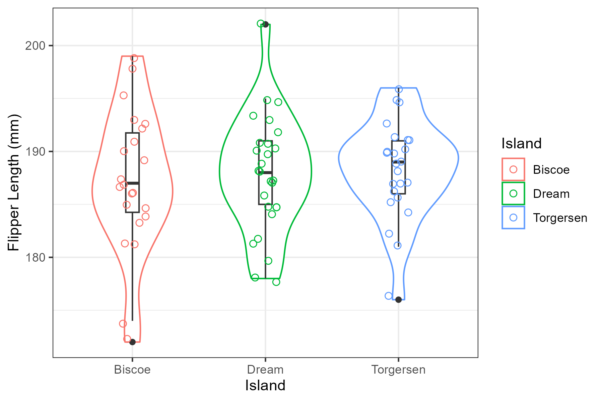
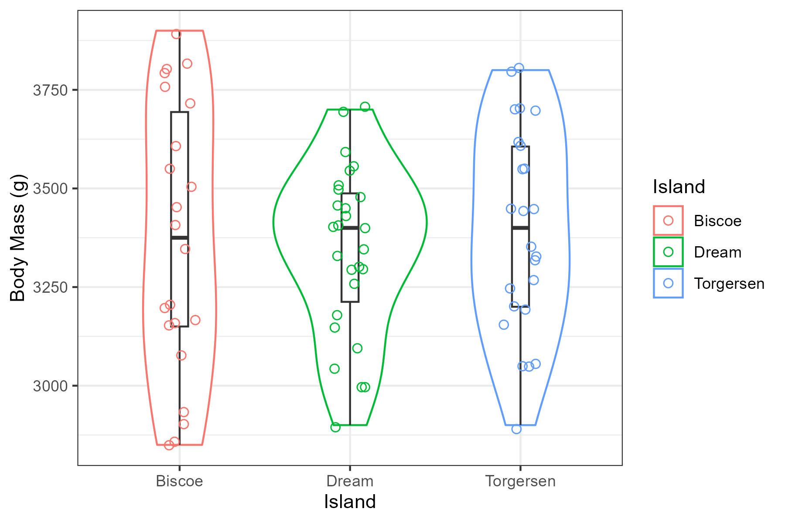

```{r setup, include=FALSE}
knitr::opts_chunk$set(echo = TRUE, warnings = FALSE)
```

# Load Packages

```{r Package_loading, message = FALSE, warning = FALSE}
library(here)
library(rticles)
library(knitr)
```

# Background

This observational study seeks to investigate the size differences in female members of the Adelie Penguin (Pygoscelis adéliae) species within the islands of the Palmer Archipelago. Specifically, this study aims to analyze the difference in flipper length (mm) and body mass (g) between female Adelie penguins within the islands of the Palmer Archipelago: Biscoe, Dream and Torgerson. Penguin growth and size are highly affected by foraging frequency, higher foraging rates lead to significant changes in mass @lescroël2021a. Additionally, changes in environmental conditions alter the frequency of foraging in many groups of penguins @kowalczyk2015. Therefore, in the case that there are differences in environments between the Biscoe, Dream and Torgerson islands, there will likely be a difference in body mass and size between the female Adelie penguins.

# Hypothesis

Hypothesis 1 (non-directional): There is a mean difference in the flipper length (mm) of female Adelie Penguins between the Biscoe, Dream and Torgerson islands of the Palmer Archipelago ($\mu_B \ne \mu_D \ne \mu_T$).

Hypothesis 2 (non-directional): There is a mean difference in the body mass (g) of female Adelie Penguins between the Biscoe, Dream and Torgerson islands of the Palmer Archipelago ($\mu_B \ne \mu_D \ne \mu_T$).

# Methods

All methods for data collection can be found at the source study [here](https://pallter.marine.rutgers.edu/catalog/erddap/dataset.php?dataset=StructuralSizeMeasurementsAndIsotopicSignaturesAdeliePenguins).

Using the data sourced from the study above @lter, the body mass and flipper length variables of the female Adelie penguins were analyzed for similarity across the three islands in the study: Biscoe, Dream and Torgerson. Two descriptive statistics tables were generated to display the mean flipper length and mean body mass values along with measures of uncertainty. Two violin plots were then produced to visualize if there was a difference between the islands for both flipper length and body mass. Data and code to replicate these methods are available in the data and code availability section.

# Results

## Flipper Length

The data was analyzed to test if there was a mean difference of flipper length between the female Adelie penguins from the three islands. The data was first analyzed to acquire the mean and sample size of the data as seen in table 1.

```{r Load Table 1, message = FALSE}

Adelie_Penguin_Stats_Flipper_Length <- readr::read_csv(here::here("outputs", "Adelie_Penguin_Stats_Flipper_Length.csv"))

kable(Adelie_Penguin_Stats_Flipper_Length, caption = "Table 1. Table of descriptive statistics displaying the mean Flipper Lengths (mm) of Female Adelie Penguins of the Biscoe, Dream and Torgerson islands. The count is the number of penguins analyzed from that island, SD is standard deviation of the mean, SEM is the standard error of the mean, Low_95_confint is the lower bound of the 95% confidence interval of the mean and Upper_95_confint is the upper bound of the 95% confidence interval.", digits = 3)

```

A violin plot was then used to visualize the flipper length measurements across the 3 islands, see figure 1.



**Figure 1.** Violin plot visualizing the mean difference of flipper length (mm) between the Biscoe (n=22), Dream (n=27) and Torgerson (n=24) Islands. The individual points represent the individual data points for each island and the boxplots indicate the mean.

## Body Mass

The data was then analyzed to test the mean difference of body mass from the female Adelie penguins of Biscoe, Dream and Torgerson Islands. The mean and sample size was then analyzed, see table 2.

```{r Load Table 2, message = FALSE}

Adelie_Penguin_Stats_Body_mass <- readr::read_csv(here::here("outputs", "Adelie_Penguin_Stats_Body_mass.csv"))

kable(Adelie_Penguin_Stats_Body_mass, caption = "Table 2. Table of descriptive statistics displaying the mean body mass (g) of Female Adelie Penguins of the Biscoe, Dream and Torgerson islands. The count is the number of penguins analyzed from that island, SD is standard deviation of the mean, SEM is the standard error of the mean, Low_95_confint is the lower bound of the 95% confidence interval of the mean and Upper_95_confint is the upper bound of the 95% confidence interval.", digits = 3)

```

A violin plot was then used to visualize the body mass measurements across the 3 islands, see figure 2.



**Figure 2.** Violin plot visualizing the mean difference of body mass (g) between the Biscoe (n=22), Dream (n=27) and Torgerson (n=24) Islands. The individual points represent the individual data points for each island and the boxplots indicate the mean.

# Discussion

According to the graphs and tables generated, when comparing the mean flipper lengths and body mass of female Adelie penguins between the Biscoe, Dream and Torgerson islands, there was no significant difference. This suggests that their environments and foraging patterns are likely the similar as flipper length and body mass would have likely increased had the penguins grown larger due to more optimal and frequent foraging [patterns\@lescroël2021b](mailto:patterns@lescroël2021b){.email}. However, a statistical test should be employed to provide a more accurate depiction of the data then relying on visual assessment from the graphs and tables generated.

# Conclusion

Overall, there was no mean difference of flipper length or body mass between female Adelie penguins between Biscoe, Dream and Torgerson Islands. These results suggest that there was limited difference in the environments and foraging behaviours of the penguins leading to similar size measurements.

# Data and Code Availability

All data is available on [this](https://osf.io/s2dv8/overview?view_only=fb116c8fccd94fd4b957d10ee8576d0c) open science framework (OSF) project. All code is available at [this](https://github.com/Dylanmgeorge/Mini-Project) GitHub repository.

# References

::: {#refs}
:::
